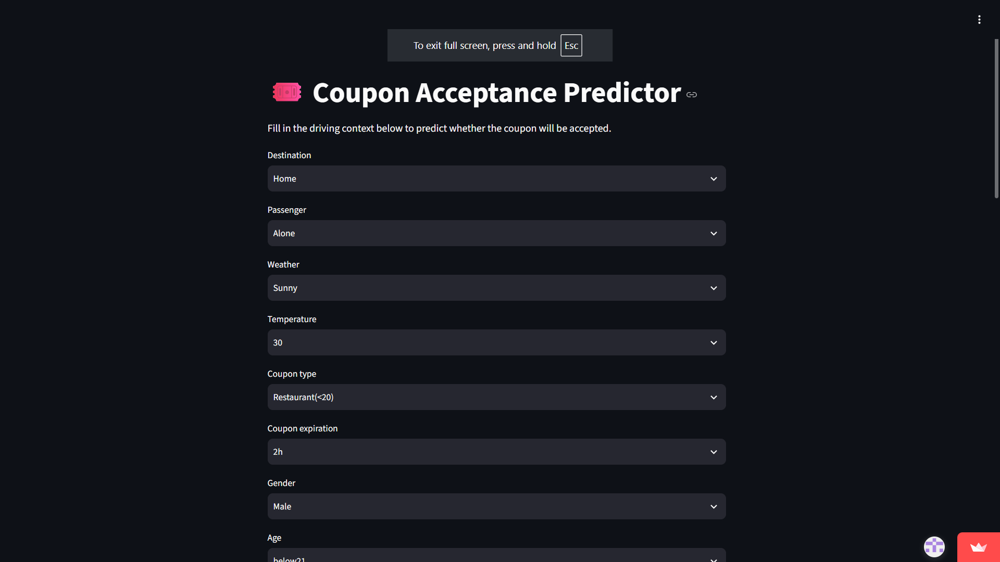

# Coupon Recommendation System

**Predicts whether a driver will redeem an in-vehicle coupon — from the weather, the destination, and who's in the car.**

[](https://www.python.org/)
[](https://coupon-predictor-system-gesj37kjnkpedfkke4f94j.streamlit.app/)

An end-to-end machine learning project on the UCI *In-Vehicle Coupon Recommendation* dataset: a driver is offered a coupon mid-trip, and the model predicts whether they'll take it. Context matters more than you'd expect — the same coffee coupon lands differently at 7am on a sunny commute than at 10pm in the rain with a passenger in the car.

The repo covers the whole path: cleaning, a scikit-learn preprocessing pipeline, a `RandomForestClassifier` tuned with `GridSearchCV`, and a Streamlit form that returns a live prediction with a confidence score. Final test accuracy is **75.44%**.

**[▶ Try the live demo](https://coupon-predictor-system-gesj37kjnkpedfkke4f94j.streamlit.app/)** — no install required.

---

## Screenshot

<!-- Replace with a real screenshot: save to docs/screenshot.png -->


---

## Features

- **Single-pipeline design** — preprocessing and model live in one `sklearn.Pipeline`, so the app can't drift out of sync with training. Serialized whole with `joblib`.
- **Handles messy real-world columns** — drops the near-empty `car` field and mode-fills the behavioral frequency columns (`Bar`, `CoffeeHouse`, `CarryAway`, `RestaurantLessThan20`, `Restaurant20To50`).
- **Tuned, not guessed** — `GridSearchCV` over `n_estimators`, `max_depth`, and `min_samples_split` with 5-fold cross-validation.
- **Reproducible training** — `src/train.py` runs the full cleaning → tuning → evaluation → save cycle in one command.
- **Interactive app** — Streamlit form collects the driving scenario and returns a prediction with a confidence score.
- **Notebook included** — `notebooks/` has the exploratory analysis and full grid-search output.

---

## Quick start

Requires **Python 3.9 or newer**.

### 1. Clone and install

```bash
git clone https://github.com/Prashant-Moyje/End-To-End-Coupon-Predictor-System-By-Random-Forest.git
cd End-To-End-Coupon-Predictor-System-By-Random-Forest

python3 -m venv venv
source venv/bin/activate          # Windows: venv\Scripts\activate

pip install -r requirements.txt
```

### 2. Launch the app

```bash
streamlit run app.py
```

Open the URL Streamlit prints, usually `http://localhost:8501`. Fill in the scenario — weather, time, destination, coupon type, expiry, passenger — and submit to get a prediction.

The trained pipeline (`coupon_model.pkl`) is committed to the repo, so this works straight from a fresh clone. No training required to see it run.

### 3. Retrain (optional)

```bash
python src/train.py
```

Cleans `data/DS_DATA.csv`, runs the grid search, prints the evaluation, and overwrites `coupon_model.pkl`. The grid search is the slow part — expect a few minutes on a laptop.

If the dataset is missing, download the [In-Vehicle Coupon Recommendation dataset](https://archive.ics.uci.edu/dataset/603/in+vehicle+coupon+recommendation) from UCI and save it to `data/DS_DATA.csv`.

---

## How it works

| Stage | What happens |
|---|---|
| **Clean** | Drop the sparsely-populated `car` column; mode-fill missing behavioral frequencies |
| **Preprocess** | `StandardScaler` on numeric features, `OneHotEncoder` on categorical, joined by `ColumnTransformer` |
| **Train** | `RandomForestClassifier` inside a `Pipeline`, tuned with `GridSearchCV` (5-fold CV) |
| **Evaluate** | Held-out 20% test split |
| **Ship** | Pipeline serialized with `joblib`, loaded by the Streamlit app |

### Results

| Metric | Score |
|---|---|
| Best cross-validation accuracy | 75.72% |
| Final test set accuracy | 75.44% |

Full classification report and the winning hyperparameters are in `notebooks/Coupon_Recommendation_System.ipynb`.

---

## Tech stack

| Layer | Tools |
|---|---|
| Language | Python 3.9+ |
| Data | pandas, NumPy |
| Modeling | scikit-learn (`Pipeline`, `ColumnTransformer`, `RandomForestClassifier`, `GridSearchCV`) |
| Serialization | joblib |
| App | Streamlit |
| Deployment | Streamlit Community Cloud |

---

## Repository structure

```text
End-To-End-Coupon-Predictor-System-By-Random-Forest/
├── data/
│   └── DS_DATA.csv                          # UCI dataset
├── notebooks/
│   └── Coupon_Recommendation_System.ipynb   # EDA + model development
├── src/
│   └── train.py                             # trains and saves the pipeline
├── app.py                                   # Streamlit app
├── coupon_model.pkl                         # generated by train.py
├── requirements.txt
└── README.md
```

---

## Deploy your own copy

1. Push the repo to your GitHub account, with `coupon_model.pkl` committed (run `src/train.py` first if it isn't there).
2. Sign in at [share.streamlit.io](https://share.streamlit.io) with GitHub.
3. **Create app** → **Deploy a public app from GitHub**.
4. Pick the repo, the `main` branch, and `app.py` as the entry point.
5. **Deploy.** Streamlit installs `requirements.txt` and gives you a public URL in a couple of minutes.

---

## Roadmap

- Benchmark against gradient-boosted models (XGBoost, LightGBM)
- Ordinal encoding for the naturally-ordered frequency columns instead of one-hot
- Wider search space via `RandomizedSearchCV`
- Handle class imbalance with `class_weight='balanced'`
- Feature importance analysis to prune low-signal columns
- Report precision/recall and AUC alongside accuracy, and compare to a majority-class baseline

---

## License

<!-- Add a LICENSE file and update this line. -->
MIT
